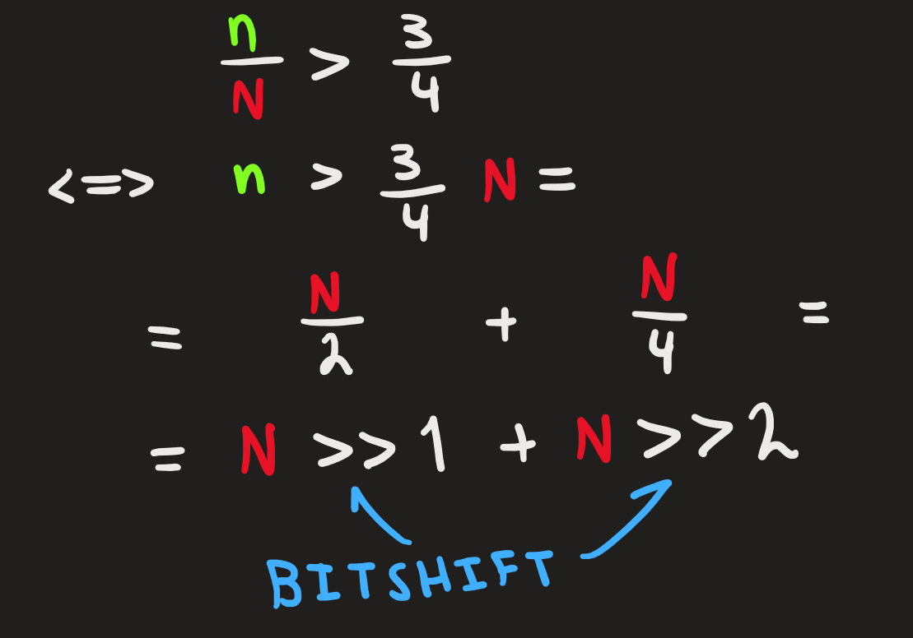
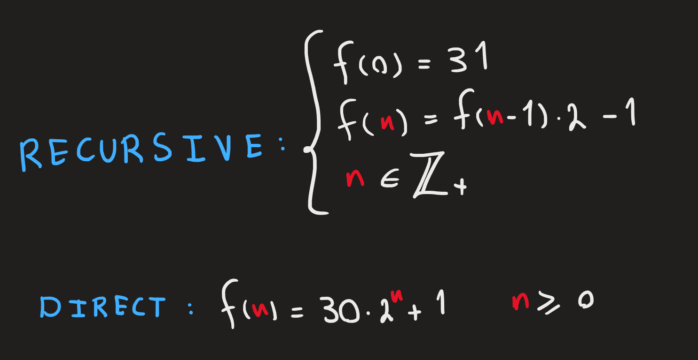
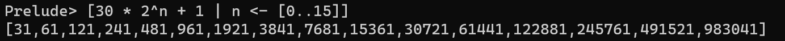

# Azeez Daoud - Database Database Wow wow!

# Running
To run the database on your table write (while in this directory):

```
cargo run <table_file_path>
```
For example running the sample table under [`./tables`](./tables/) write `cargo run ./tables/students.csv`
# Querying
Querying can be done through the commands below:

| Command                   | Description | Example |
| ---                       | ---         | ---     |
|`GET <columns> FROM <rows>`| Prints the requested column data stored in the given rows. To get all columns or rows '`*`' can be typed instead.  | `GET Age, Program OF *`         |
| `SET <column>=<value> OF <row>`| Sets the given data columns to the given values of a single given row         | `SET Age=10, Program=CDATE OF Bob`     |
| `INSERT <row_name> : <value>, <value>...`| Inserts a new row into the table using the given data. NOTE! The data must be given in order according to the header and must be in the correct type. | `INSERT Bilbo : 111, CDATE` |
| `DELETE <row_name>` | Deletes the row with the given row name` | `DELETE Bobby` |
| `SAVE`              | Not technically a query. This command saves the table into the table it was opened from|

# Creating your own table
To create your own table, create a `.csv` file (it can be anything really but the file will be in "Comma Separated Values"-format, so be conventional).

Open your newly created file and add your desired header following these:

Each value (separated by a comma) in the header represents a column in the table and should have the format `<type>:<name>`, where type is a single character representing the type of data stored in that column. The following table shows what characters represent what

| Character | Data type |
|---        |---        |
| `w`       | Word, a string without any spaces |
| `u`       | Unsigned 32-bit integer|
| `i`       | Signed 32-bit integer|
| `f`       | 32-bit floating-point number|
| `b`       | Boolean | 

An example of a header is: `w:Class, u:Mana, f:Speed`. Another example is under [`./tables`](./tables/)

# Mathy math
## Formula for size checking
The Map's *max* is the length of the internal vector (buckets). It also has a field called *size* which is the amount of occupied slots inside that internal vector.

Automatic resizing is done when the *size* is 75% of the *max*. The formula to check this uses bitshifts for faster calculations.

Call *max* **N** and occupation size for **n** then



hence the check for the size is done with:
```rust
// max = self.buckets.len()
self.size > (max >> 1) + (max >> 2)
```

## Initial size and resize formula
As mentioned in [Size Checking](formula-for-size-checking), when the amount of occupied slots reach ~75% the Map resizes itself using the formula below.
Note the initial size for the Map is 31 and continues on increasing using the "* 2 - 1".



The first few numbers that this sequence produces are primes or have few factors of large prime numbers. Here are some of the few terms
